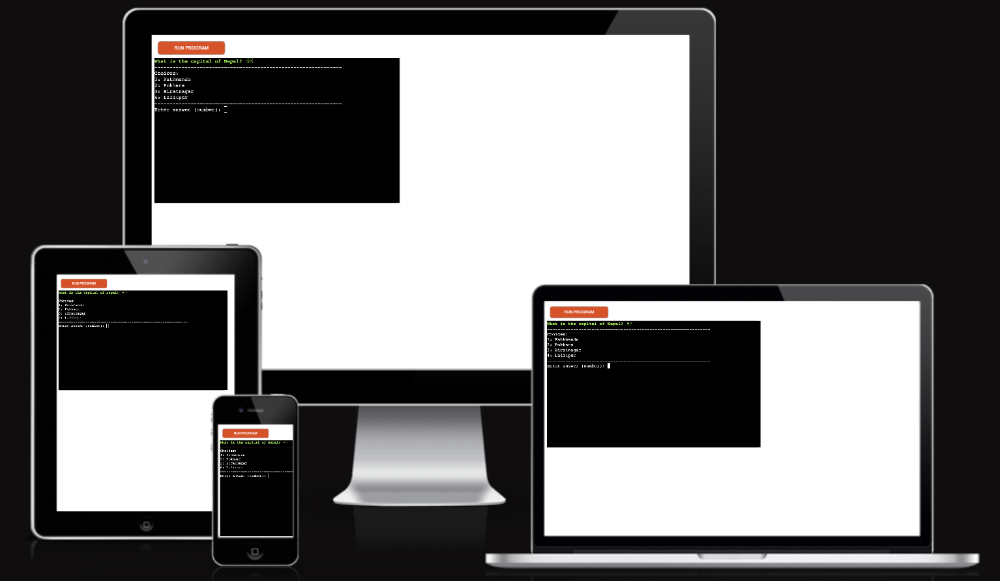
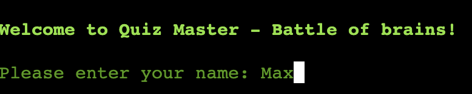
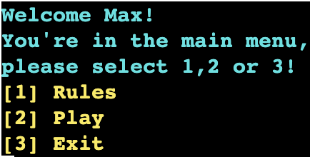
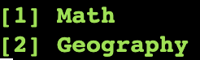
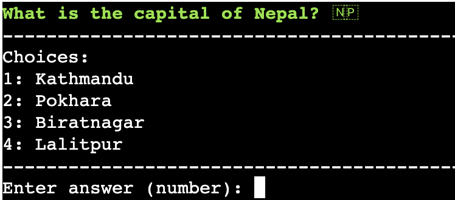
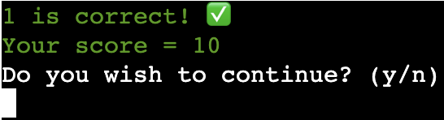
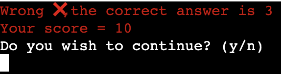
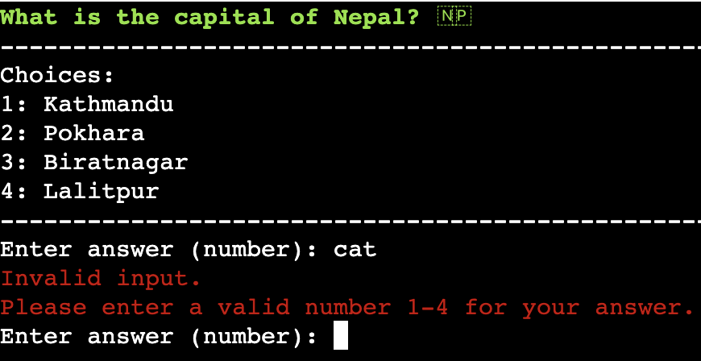
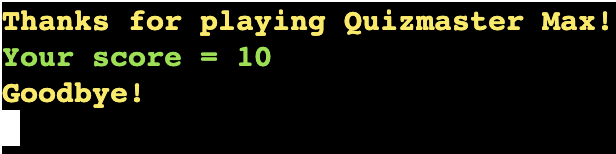
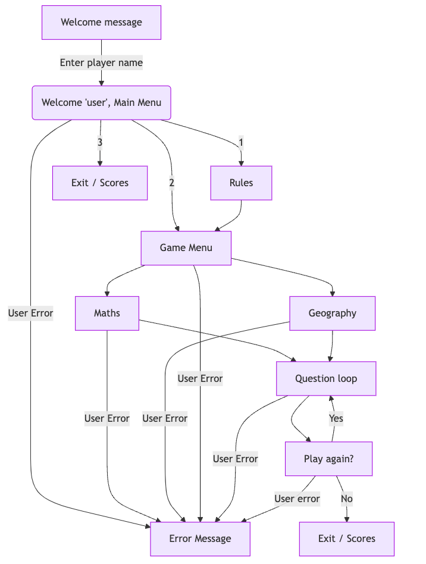

# [QUIZMASTER BATTLE OF BRAINS ](https://quizmaster-battle-of-brains-1c2d93e6ca7f.herokuapp.com/)

# Quizmaster - Battle of Brains

Welcome to Quizmaster - Battle of Brains! Quizmaster is a Python terminal quiz game. The user can choose between a Maths-Quiz, and a Geography-Quiz yet, more quiz-options are about to come. Users will answer unlimited questions with mutliply choice answers. Only one answer ist correct. Each answer gives 10 points. Goal of the game is to get the highest possible score. Quizmaster - Battle of Brains is aimed at people of all ages and may be useful to those hoping to improve their general knowledge. The site is very intuitive and easy to navigate.

source: [amiresponsive](https://ui.dev/amiresponsive?url=https://quizmaster-battle-of-brains-1c2d93e6ca7f.herokuapp.com/)

## UX

As the application runs in the Python mock terminal, the design process was very straight forward. The main focus was on functionality. Nevertheless, line breaks and the integration of colorama and the associated color highlighting of sections were used to create a gaming experience that is as pleasant as possible for the user.

### Existing Features

- **Welcome-Page**

    - The Welcome-Page welcomes the user to play Quizmaster in bright green text and asks the users to enter their name.

- **Main-Menu**

    - Gives the user the possibility to read the rules of the game, choose between the different quiz-options or exit the program. Bright cyan and yellow text is used to differentiate the sections.

- **Game-Menu**

    - Let the user select the different quiz-options in bright green text.

- **Questions**

    - The question page displays the question with the answer request. The possible answer options are listed from 1-4. For the Maths-Quiz only the possible results of the math tasks are getting displayed as multiplychoice options, to not confuse the user with a visual overload of numbers.

- **Correct answer**

    - When the user gets an answer correct, a green 'Correct' appears along with a green checkmark. The users are then asked if they want to continue playing. In order to do so, users are prompted to select y for yes or n for no, which will either load and display the next question or terminate the game.

- **Incorrect answer**

    - When the user selects an incorrect answer, a red 'Wrong' appears along with a red X. The users are then asked if they want to continue playing. In order to do so, users are prompted to select y for yes or n for no, which will either load and display the next question or terminate the game.

- **Error-Handling**

    - Should the user enter an incorrect keyboard selection, they will be presented with bright red text prompting them to enter a valid option.

- **End of Game & Results**

    - Should the after a correct or incorrect answer decide not to play again, they are presented with a message thanking them for playing Quizmaster in bright yellow text. The achieved user-score is getting displayed in bright green text to differentiate the sections.

### Future Features

- Multiple Quiz-Categories
    - I would like to add a variaty of different quiz-types (Sports, Politics, Movies, Music are just a few to name).
- Highscores
    - I want to implement a Highscores-System which memorizes each entered player-name together with the achieved score.
- Random question selection
    - I want to implement a function to achieve a random selection on choosing quiz questions to make the game more challenging for repeating users.

## Tools & Technologies Used

- [Python](https://www.python.org) used as the back-end programming language.
- [Git](https://git-scm.com) used for version control. (`git add`, `git commit`, `git push`)
- [GitHub](https://github.com) used for secure online code storage.
- [GitHub Pages](https://pages.github.com) used for hosting the deployed front-end site.
- [Gitpod](https://gitpod.io) used as a cloud-based IDE for development.
- [Heroku](https://www.heroku.com) used for hosting the deployed back-end site.

## Data Model

### Flowchart

Mermaid flowchart TD
    A[Welcome message] -->|Enter player name| B(Welcome 'user', Main Menu)
    B -->|1| C[Rules]
    B -->|2| D[Game Menu]
    B -->|3| T[Exit / Scores]
    B --> |User Error| K[Error Message]
    C --> D[Game Menu]
    D --> E[Maths] --> |User Error| K[Error Message]
    D --> F[Geography] --> |User Error| K[Error Message]
    D --> |User Error| K[Error Message]
    E --> G[Question loop]
    F --> G[Question loop] 
    G --> H[Play again?]
    G --> |User Error| K[Error Message]
    H -->|Yes| G
    H -->|No| I[Exit / Scores]
    H -->|User error| K[Error Message]

To follow best practice, a flowchart was created for the app's logic,
and mapped out before coding began using a free version of
[Mermaid](https://mermaid.live/edit#pako:eNqVUt1LwzAQ_1eOvExhIupbHxS3dp1IRd1EJO1DaG9toU1KPtCx7H83Jiob7mHmJZf7fVy4uw0pRYUkIqtOvJcNkxqWcc7BnVv6il0peoQelWI1FnB2dm0TrlHC0LG1uzjr0cLk5Ic5MgrlaAwZazlkyM1p8Jp46YWFKX02HapiN31pIaapc_KKPejKwpImH62Gc1iUQu4rwb64cpBIKaSFe-oDZxJ-G4hTT_zrH_t8QjOmG1Uc6xZUM5qiqCUbmvU_lUcQE09M6ZNBpVvBoRNi-MZmBzEIYOrBOX10owFWuwncFLvIEbXnvulvqCyku5kHYeHu4BwC7p3xsDMZkx5lz9rKbdnmS5UT3WCPOYlcWOGKmU7nJOdbR2VGi8WalyTS0uCYSGHqhkQr1in3MkPFNMYtc83vf7NYtVrILOyxX-ftJ0X75fI)

Below is the flowchart of the main process of this Python program. It shows the entire cycle of the program.

### Functions

The primary functions used on this application are:

- `clean()`
    - Deleting terminal.
- `welcome()`
    - Welcome message, name validation.
- `validate_player()`
    - Validate input of player-name.
- `menu()`
    - Main menu. Press 1 for Rules, 2 for quiz selection, 3 to exit.
- `game_menu()`
    - Quiz selection.
- `main-math()`
    - Loop through math questions.
- `main-geography()`
    - Loop through geography questions.
- `keep_going()`
    -  loads next question, or exit the game and verifies right or wrong user selection.

### Imports

I've used the following Python packages and/or external imported packages.

- `time`: used for adding time delays
- `os`: used for adding a `clear()` function
- `colorama`: used for including color in the terminal
- `random`: will be used to get a random choice from the questions
- `sys`: used to see paths to files and exit code if necessary

## Testing

> [!NOTE]  
> For all testing, please refer to the [TESTING.md](TESTING.md) file.

## Deployment

Code Institute has provided a [template](https://github.com/Code-Institute-Org/python-essentials-template) to display the terminal view of this backend application in a modern web browser.
This is to improve the accessibility of the project to others.

The live deployed application can be found deployed on [Heroku](https://quizmaster-battle-of-brains-1c2d93e6ca7f.herokuapp.com/).

### Heroku Deployment

This project uses [Heroku](https://www.heroku.com), a platform as a service (PaaS) that enables developers to build, run, and operate applications entirely in the cloud.

Deployment steps are as follows, after account setup:

- Select **New** in the top-right corner of your Heroku Dashboard, and select **Create new app** from the dropdown menu.
- Your app name must be unique, and then choose a region closest to you (EU or USA), and finally, select **Create App**.
- From the new app **Settings**, click **Reveal Config Vars**, and set the value of KEY to `PORT`, and the value to `8000` then select *add*.
- If using any confidential credentials, such as CREDS.JSON, then these should be pasted in the Config Variables as well.
- Further down, to support dependencies, select **Add Buildpack**.
- The order of the buildpacks is important, select `Python` first, then `Node.js` second. (if they are not in this order, you can drag them to rearrange them)

Heroku needs two additional files in order to deploy properly.
- requirements.txt
- Procfile

You can install this project's **requirements** (where applicable) using:
- `pip3 install -r requirements.txt`

If you have your own packages that have been installed, then the requirements file needs updated using:
- `pip3 freeze --local > requirements.txt`

The **Procfile** can be created with the following command:
- `echo web: node index.js > Procfile`

For Heroku deployment, follow these steps to connect your own GitHub repository to the newly created app:

Either:
- Select **Automatic Deployment** from the Heroku app.

Or:
- In the Terminal/CLI, connect to Heroku using this command: `heroku login -i`
- Set the remote for Heroku: `heroku git:remote -a app_name` (replace *app_name* with your app name)
- After performing the standard Git `add`, `commit`, and `push` to GitHub, you can now type:
	- `git push heroku main`

The frontend terminal should now be connected and deployed to Heroku!

### Local Deployment

This project can be cloned or forked in order to make a local copy on your own system.

For either method, you will need to install any applicable packages found within the *requirements.txt* file.
- `pip3 install -r requirements.txt`.

If using any confidential credentials, such as `CREDS.json` or `env.py` data, these will need to be manually added to your own newly created project as well.

#### Cloning

You can clone the repository by following these steps:

1. Go to the [GitHub repository](https://github.com/Maxcode0101/QuizMaster-Battle-of-Brains-) 
2. Locate the Code button above the list of files and click it 
3. Select if you prefer to clone using HTTPS, SSH, or GitHub CLI and click the copy button to copy the URL to your clipboard
4. Open Git Bash or Terminal
5. Change the current working directory to the one where you want the cloned directory
6. In your IDE Terminal, type the following command to clone my repository:
	- `git clone https://github.com/Maxcode0101/QuizMaster-Battle-of-Brains-.git`
7. Press Enter to create your local clone.

Alternatively, if using Gitpod, you can click below to create your own workspace using this repository.

Please note that in order to directly open the project in Gitpod, you need to have the browser extension installed.
A tutorial on how to do that can be found [here](https://www.gitpod.io/docs/configure/user-settings/browser-extension).

#### Forking

By forking the GitHub Repository, we make a copy of the original repository on our GitHub account to view and/or make changes without affecting the original owner's repository.
You can fork this repository by using the following steps:

1. Log in to GitHub and locate the [GitHub Repository](https://github.com/Maxcode0101/QuizMaster-Battle-of-Brains-)
2. At the top of the Repository (not top of page) just above the "Settings" Button on the menu, locate the "Fork" Button.
3. Once clicked, you should now have a copy of the original repository in your own GitHub account!

## Credits

### Content

| Source | Location | Notes |
| --- | --- | --- |
| [Markdown Builder](https://tim.2bn.dev/markdown-builder) | README and TESTING | "Tool to help generate the Markdown files" |
| [StackOverflow](https://stackoverflow.com/questions/2084508) | entire site | "How to define a function to clear the terminal in Python" |
| [StackOverflow](https://stackoverflow.com/questions/32332217) | entire site | "How to validate a name in Python" |
| [StackOverflow](https://stackoverflow.com/questions/30001342) | entire site | "Exiting a program from an If/ELSE statement with Python" |
| [Real Python](https://realpython.com/python-quiz-application/) | entire site | "Get an overall understanding of how a quiz application in Python works" |
| [YouTube](https://www.youtube.com/watch?v=YScd9FqGAZs&t=358s) | entire video | "How to use a dictionary and for loop in a Python quiz application" |
| [YouTube](https://www.youtube.com/watch?v=u51Zjlnui4Y) | entire video | "Tutorial for adding color to the Python terminal |

### Media

| Source | Location | Type | Notes |
| --- | --- | --- | --- |
| [Emojipedia](https://emojipedia.org/search/?q=flags) | questionlist.py | emojis | "Flags in questions and right and wrong emojis" |
| [ChatGPT](https://chatgpt.com/) | questionlist.py | questions | "Generating Math & Geography questions" |
| [Mermaid](https://mermaid.live/) | README.md | developing process | "Generating flowchart" |

### Acknowledgements

- I would like to thank my Code Institute mentor, [Tim Nelson](https://github.com/TravelTimN) for his support throughout the development of this project.
- I would like to thank the [Code Institute](https://codeinstitute.net) tutor team for their assistance with troubleshooting and debugging some project issues.
- I would like to thank the [Code Institute Slack community](https://code-institute-room.slack.com) for the moral support; it kept me going during periods of self doubt and imposter syndrome.