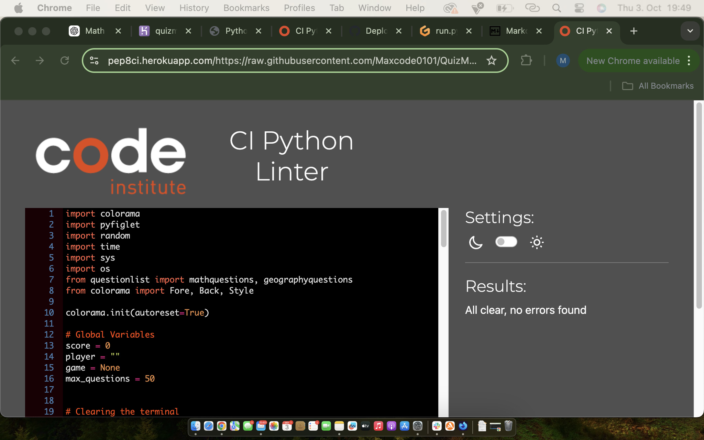
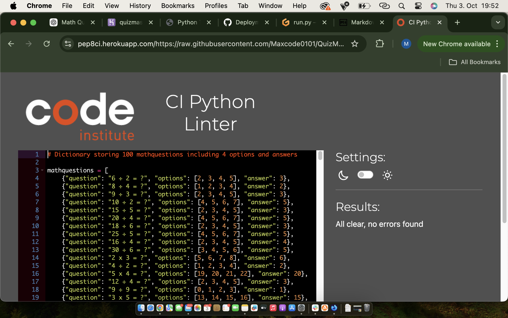

# Testing

Return back to the [README.md](README.md) file.

## Code Validation

### Python

I have used the recommended [PEP8 CI Python Linter](https://pep8ci.herokuapp.com) to validate all of my Python files.

| File | CI URL | Screenshot | Notes |
| --- | --- | --- | --- |
| run.py | [PEP8 CI](https://pep8ci.herokuapp.com/https://raw.githubusercontent.com/Maxcode0101/QuizMaster-Battle-of-Brains-/refs/heads/main/run.py) |  | Pass: No Errors |
| questions.py | [PEP8 CI](https://pep8ci.herokuapp.com/https://raw.githubusercontent.com/Maxcode0101/QuizMaster-Battle-of-Brains-/refs/heads/main/questionlist.py) |  | Pass: No Errors |

## Browser Compatibility, Responsiveness

I've tested my deployed project on multiple browsers and devices to check for compatibility issues. There is some known issues I'm aware of. The keyboard is without function on mobile and on certain browsers (Safari)

| Browser | Screenshot | Notes |
| --- | --- | --- |
| Chrome |  | Works as expected |
| Firefox |  | Works as expected |
| Edge |  | Works as expected |
| Safari |  | Does not work on Safari |
| Brave |  | Works as expected |
| Opera |  | Works as expected |

## Responsiveness

I've tested my deployed project on multiple devices to check for responsiveness issues.

| Device | Screenshot | Notes |
| --- | --- | --- |
| Mobile (DevTools) |  | Not responsive |
| Tablet (DevTools) |  | Not responsive |
| Desktop |  | Works as expected |

## Lighthouse Audit

I've tested my deployed project using the Lighthouse Audit tool to check for any major issues.

| Page | Size | Screenshot | Notes |
| --- | --- | --- | --- |
| Home | Desktop |  | Few warnings |

## Defensive Programming

Defensive programming was manually tested with the below user acceptance testing:

| Page | User Action | Expected Result | Pass/Fail | Screenshot |
| --- | --- | --- | --- | --- |
| Name Input | | | | |
| | Enter a name | Field will only accept 2-15 letters | Pass |  |
| Category Selection | | | | |
| | Enter 1 or 2 to choose a category | Field will only accept 1 or 2 | Pass |  |
| Answer Input | | | | |
| | Enter a,b,c,d to select an answer | Field will only accept the letters a,b,c,d uppercase or lowercase | Pass |  |
| Play Again | | | | |
| | Enter yes/no to play again | Field will accept any input that begin with y or n | Pass |  |

## Bugs

- Unable to input text to the terminal on Safari desktop or mobile.

    

- Flag emojis not displaying on all browsers tested

    

There are no remaining bugs that I am aware of.
