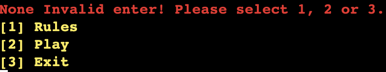
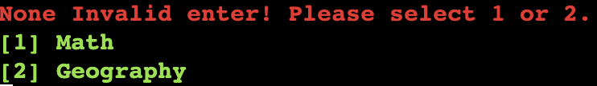
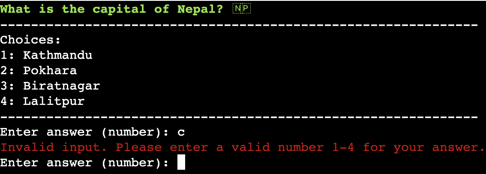
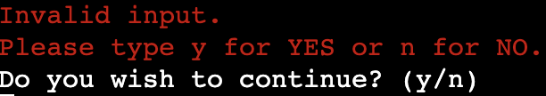
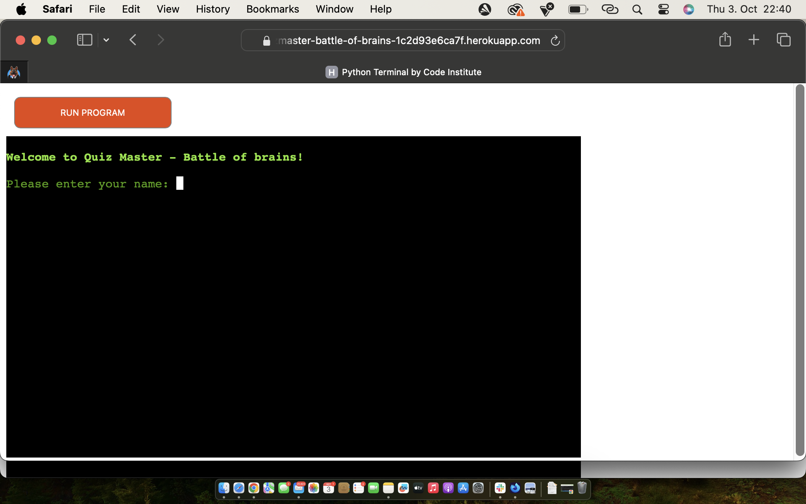
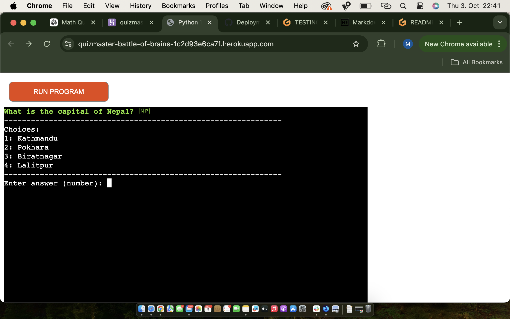

# Testing

Return back to the [README.md](README.md) file.

## Code Validation

### Python

I have used the recommended [PEP8 CI Python Linter](https://pep8ci.herokuapp.com) to validate all of my Python files.

| File | CI URL | Screenshot | Notes |
| --- | --- | --- | --- |
| run.py | [PEP8 CI](https://pep8ci.herokuapp.com/https://raw.githubusercontent.com/Maxcode0101/QuizMaster-Battle-of-Brains-/refs/heads/main/run.py) |  | Pass: No Errors |
| questions.py | [PEP8 CI](https://pep8ci.herokuapp.com/https://raw.githubusercontent.com/Maxcode0101/QuizMaster-Battle-of-Brains-/refs/heads/main/questionlist.py) |  | Pass: No Errors |

## Browser Compatibility, Responsiveness

I've tested my deployed project on multiple browsers and devices to check for compatibility issues. There is some known issues I'm aware of. The keyboard is without function on mobile and on certain browsers (Safari)

## Defensive Programming

Defensive programming was manually tested with the below user acceptance testing:

| Page | User Action | Expected Result | Pass/Fail | Screenshot |
| --- | --- | --- | --- | --- |
| Name Input | | | | |
| | Enter a name | Field will only accept 2-30 letters | Pass |  |
| Main menu | | | | |
| | Enter 1, 2 or 3 to choose between Rules, Play and Exit | Field will only accept 1, 2 or 3 | Pass | 
 |
| Game Selection | | | | |
| | Enter 1 or 2 to choose a Quiz Category 
| Field will only accept 1 or 2 | Pass | 
 |
| Answer Input | | | | |
| | Enter 1,2,3,4 to select an answer | Field will only accept the numbers provided in the multiply choice options | Pass | 
 |
| Play Again | | | | |
| | Enter yes/no to play again | Field will accept any input that begin with y or n | Pass | 
 |

## Bugs

- Unable to input text to the terminal on Safari desktop or mobile.

    

- Flag emojis not displaying on all browsers tested

    

There are no remaining bugs that I am aware of.
